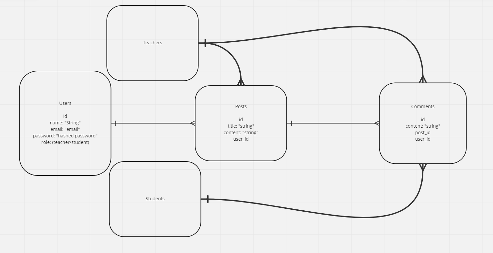

# ClassBlog Backend
ClassBlog is an application designed to be used in the classroom as an alternative to social media.  ClassBlog allows social interaction between teachers and students in a class, without the dangers associated with the broader internet. This Repository is the server-end for ClassBlog.
## ERD
Here is an Entity-Relationship Diagram demonstrating my models:

## Technologies Used
- Javascript
- MongoDB
- Mongoose
- Express.js
- Node.js
## Getting Started and more info
See the front-end repo [here](https://github.com/TimMMartinson/class-blog-frontend)

and see ClassBlog [here](https://classblog.onrender.com/)